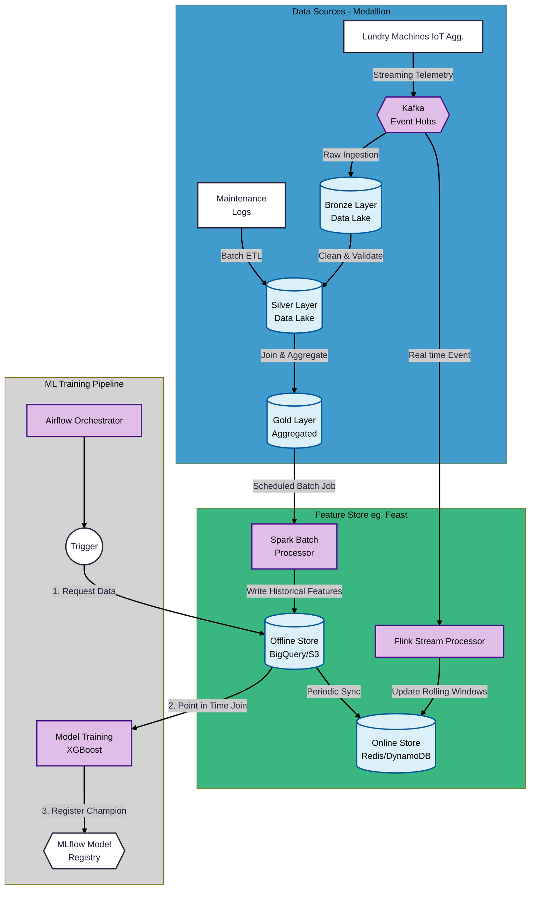

# Solution Architecture for PM Workwear Laundries

The following sections describes a concept to the proposed ML Solution to predict when a laundry machine is most likely to break, providing an on time alert indicating the necessity of maintenance and avoiding the high costs of a machine change. 



<!--  -->

## Diagram Explanation

### 1.1 Data Sources & Ingestion

- Laundry Machines (IoT) Agg.: The source of truth. Streams raw sensor data (temperature, vibration) constantly.

- Kafka Event Hub: The central nervous system buffering high-velocity streaming data.

### 1.2 The Data Lake "Medallion" Flow (Blue Subgraph)

- Bronze: Raw, immutable data dumped straight from Kafka.

- Silver: Cleaned data. Physics constraints applied (e.g., temp clipped at 100°C). Maintenance logs are joined here.

- Gold: Highly aggregated data ready for machine learning (e.g., pre-calculated daily summaries).

### 2. The Feature Store (Green Subgraph)

This is the critical bridge that solves the "training-serving skew" problem.

**The Offline Path:**

- Uses Batch Processors (Spark) to calculate heavy historical features from the Gold Layer. Stores them in the Offline Store (S3/BigQuery).

- Crucial Function: Performs Point-in-Time Joins for training, ensuring the model only sees data that existed before a failure occurred (preventing leakage).

** The Online Path:**

- Uses Stream Processors (Flink) to calculate rolling windows (e.g., "Max Vibration Last 7 Days") in near real-time straight from Kafka.

- Updates the Online Store (Redis) immediately. This store is optimized for sub-millisecond retrieval, not massive storage.

### 3. ML Training Pipeline (Gray Subgraph)

- Orchestrator (Airflow): manages the schedule.
It pulls historical data from the Offline Store to train the XGBoost model.

- The final "Champion" model is saved to the Model Registry (MLflow), versioned and ready for deployment.

### 5. Deployment & Inference

This image describes the live production architecture and how it triggers the creation of new models.

<!--  -->


**Prediction Workflow:** (blue arrows)

0. A machine sends its **current sensor reading** to the API. 
1. The API instantly **queries** the Online Store (Redis) for the machine's 7-day historical context.
2. Combining **current** and **historical** data, passes it to the loaded XGBoost model, and generates a **prediction**. 
3.
    ``` 
    If prediction > the threshold:
        send an alert to the Dashboard.
    ```

**The Monitoring Loop** (red arrows)

4. Drift Detection: The API sends **input data** and **predictions** to a monitoring system. 
5. If the incoming data starts looking different from the training data (Data Drift), or if Recall drops (Concept Drift), it signals the Orchestrator to trigger a re-training cycle.
    ```
    If data_drift or recall drops:
       trigger a re-training cycle
    ``` 
6. The new Model is then registered on the Model Register (ML Enginee)