## Diagram Legend & Explanation

### 1. Data Sources & Ingestion

- Laundry Machines (IoT) Agg.: The source of truth. Streams raw sensor data (temperature, vibration) constantly.

- Kafka Event Hub: The central nervous system buffering high-velocity streaming data.

### 2. The Data Lake "Medallion" Flow (Blue Storage)

- Bronze: Raw, immutable data dumped straight from Kafka.

- Silver: Cleaned data. Physics constraints applied (e.g., temp clipped at 100°C). Maintenance logs are joined here.

- Gold: Highly aggregated data ready for machine learning (e.g., pre-calculated daily summaries).

### 3. The Feature Store (Green Subgraph)

This is the critical bridge that solves the "training-serving skew" problem.

#### The Offline Path:

- Uses Batch Processors (Spark) to calculate heavy historical features from the Gold Layer. Stores them in the Offline Store (S3/BigQuery).

- Crucial Function: Performs Point-in-Time Joins for training, ensuring the model only sees data that existed before a failure occurred (preventing leakage).

#### The Online Path:

- Uses Stream Processors (Flink) to calculate rolling windows (e.g., "Max Vibration Last 7 Days") in near real-time straight from Kafka.

- Updates the Online Store (Redis) immediately. This store is optimized for sub-millisecond retrieval, not massive storage.

### 4. ML Training Pipeline

- Orchestrator (Airflow): manages the schedule.
It pulls historical data from the Offline Store to train the XGBoost model.

- The final "Champion" model is saved to the Model Registry (MLflow), versioned and ready for deployment.

### 5. Deployment & Inference (Second Graph)

Model Serving API (Kubernetes/Docker): This is the live production endpoint.

The Workflow:

1. A machine sends its current temperature reading to the API.
2. The API instantly queries the Online Store (Redis) for the machine's 7-day historical context.
3. It combines current + historical data, passes it to the loaded XGBoost model, and generates a prediction.
4. If the prediction exceeds the threshold, an alert is sent to the Dashboard.

### 6. The Feedback Loop (Monitoring)

Drift Detection: The API sends input data and predictions to a monitoring system. If the incoming data starts looking different from the training data (Data Drift), or if Recall drops (Concept Drift), it signals the Orchestrator to trigger a re-training cycle.