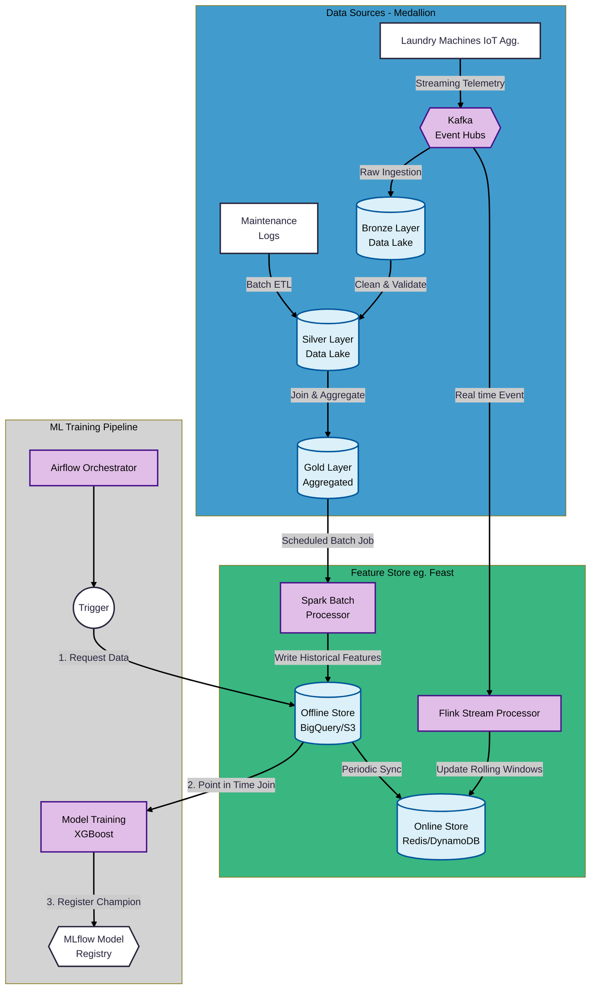
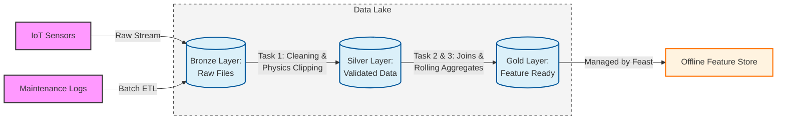
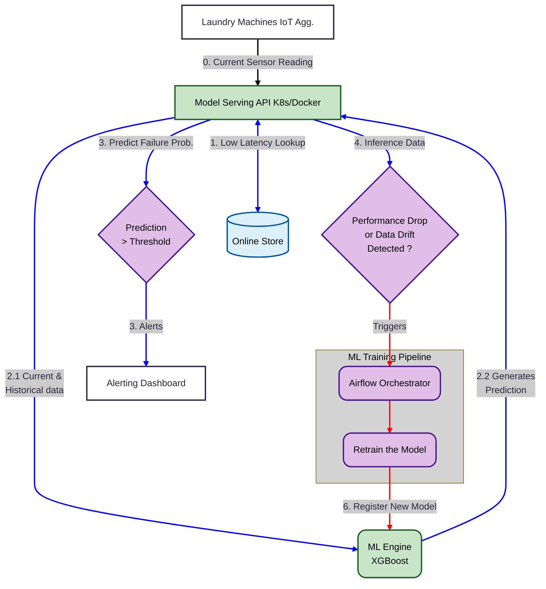

# Solution Architecture: PM Workwear Laundries

This document outlines the end-to-end MLOps architecture for predicting laundry machine failures. The solution is designed to maximize Recall (99%), ensuring that high-cost machine downtime is minimized through a "Dual-Loop" predictive system.



## 1. Data Foundations & The Medallion Flow
To maintain high data quality for our XGBoost model, we utilize a Medallion Architecture. This ensures that raw sensor "noise" is filtered before reaching the Feature Store.


**Bronze (Ingestion):** Captures raw, immutable telemetry from Kafka.

**Silver (Validation):** Applies physics-based constraints (e.g., temperature clipping) and deduplication. Maintenance logs are integrated here to provide historical context.

**Gold (Aggregated):** Features are finalized for ML consumption, including pre-calculated health indicators and cumulative runtime stats.

## 2. The Feature Store (Feast Implementation)

The Feature Store acts as the "Single Source of Truth," eliminating the risk of Training-Serving Skew by using identical logic for both historical and live data.

| Feature        | Offline Path (Training)          | Online Path (Inference)         |
|----------------|----------------------------------|---------------------------------|
| Logic Source   | Gold Layer (S3/Parquet)          | Kafka / Streaming Telemetry     |
| Processing     | Spark Batch / Pandas             | Flink or Spark Streaming        |
| Feast Role     | Point-in-Time Joins (Historical) | Low-Latency Serving (Real-time) |
| Storage Medium | Offline Store (Data Lake)        | Online Store                    |
| Technology	 | S3 / Parquet / BigQuery	        | Redis / SQLite / DynamoDB       |

# 3. Training & Model Registry
**Orchestration:** Managed by Apache Airflow, which schedules retraining based on time intervals or "Drift" triggers.

**Registry:** The MLflow Model Registry manages versioning. Every model is tagged as either a *"Challenger"* (under evaluation) or *"Champion"* (production-active).

# 4. Deployment & Real-Time Inference
This phase describes how the live production environment interacts with the Feature Store to generate actionable alerts.



## 4.1 Prediction Workflow (Blue Path)

**Request:** Machine sends a payload (e.g., Temperature, Current Vibration).

**Enrichment:** API queries the Online Store (Redis/SQLite) for the 7-day historical features (e.g., *vibration_rolling_max_7d*).

**Inference:** Data is passed to the XGBoost Engine.

```
IF Prediction Probability > 0.45 THEN 
    Dispatch Maintenance Alert to Dashboard.
```

## 4.2 Monitoring & Retraining (Red Path)

**Drift Detection:** Input features are monitored. If the average vibration of the fleet shifts >2σ, the system flags Data Drift.

```
IF Data Drift detected OR Recall < 85% THEN 
    Signal Airflow to launch a new Training Job.
```

**Registry Sync:** The new model is registered and promoted to the ML Engine.

# 5. Operational Maintenance
## 5.1 CI/CD & Shadow Deployment

New models are deployed in Shadow Mode first. They process live data without sending alerts to technicians. We only promote a *"Challenger"* to *"Champion"* once it proves it maintains 99% Recall on real-world distributions.

## 5.2 The Feedback Loop

Technician findings (e.g., "Actual Part Failure" vs "False Alarm") are logged in the maintenance app. This data is piped back into the Gold Layer, creating a "Ground Truth" label for the next month's training cycle, ensuring the model evolves with the hardware.

## Tech Stack Summary

| Component      | Tool / Technology    | Role in Your Project                          |
|----------------|----------------------|-----------------------------------------------|
| Ingestion      | Kafka / Event Hubs   | Sensor data streaming.          |
| Processing     | Spark / Pandas       | **Task 1** & **3** cleaning and rolling features.     |
| Data Lake      | Delta Lake / Parquet | Medallion storage (Bronze/Silver/Gold).       |
| Feature Store  | Feast                | The registry and manager for feature logic.   |
| Offline Store  | S3 / Parquet         | Historical data for Point-in-Time joins.      |
| Online Store   | Redis / SQLite       | Low-latency storage for the Inference API.    |
| Model Registry | MLflow               | Versioning the XGBoost "Champion" models.    |
| Orchestration  | Apache Airflow       | Triggering **Task 2** labels and **Task 6** training. |
| Deployment     | FastAPI / Docker     | Serving the model as a microservice.          |