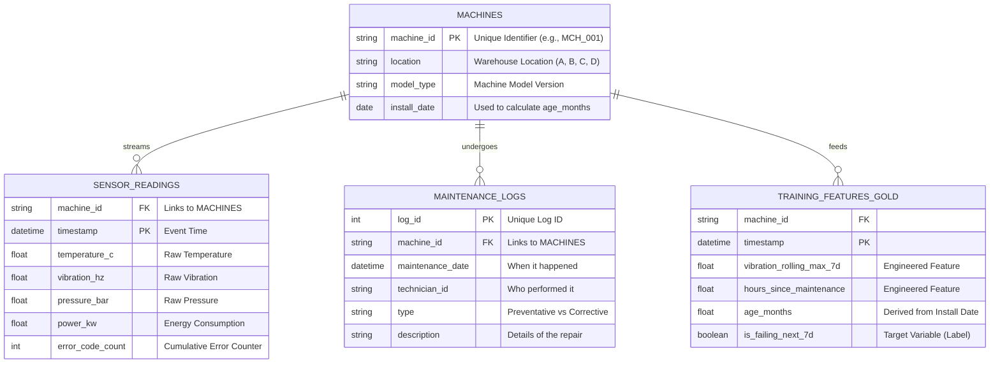

# Data Cleaning Taks and Data Model

## Data Model Description

- `MACHINES` (Dimension): The parent table. It holds the "slowly changing" metadata. machine_id is the primary key that glues everything together.

- `SENSOR_READINGS` (Fact): This is your massive "Bronze/Silver" layer. It has a composite key relationship: one machine has millions of timestamped readings.

- `MAINTENANCE_LOGS` (Fact): Sparse data. This is crucial for calculating the hours_since_maintenance feature.

- `TRAINING_FEATURES_GOLD` (Analytic): This isn't usually a normalized database table, but rather the denormalized flat view (Parquet file) created by your pipeline to feed the XGBoost model. It combines attributes from all three tables above.



The file `clean_data` is a small helper script to remove outliers and uniform timestamps in CSV time-series data.

Dependencies:
- pandas
- numpy

**Single File processing**

Example:
```bash
python data_cleaning/clean_data.py \
  --input data/raw/telemetry.csv \
  --output data/cleaned/telemetry_standardized.csv \
  --timestamp-col datetime \
  --freq 1H \
  --min-val 0 \
  --max-val 100 \
  --outlier-action median
```

Options:
- `--timestamp-col`:	Name of the column containing dates/times (e.g., timestamp or datetime).
- `--freq`:	Target pandas frequency (e.g., 1min, 1H, 1D). Set to empty string to skip.
- `--outlier-action`:	Action for values outside range: mark (NaN), drop (delete row), or median (impute with median).
- `--min-val`:	The minimum physically possible sensor value (default: 0.0).
- `--max-val`:	The maximum physically possible sensor value (default: 100.0).
- `--no-interpolate`:	Disables linear interpolation for missing numeric values during resampling.
- `--agg-method`:	How to combine data during resampling (e.g., mean, median).

**Batch processing**

1. Setup Data Directory Before running the script, ensure raw data is in the correct location.
   - Create a folder named data/raw in the root of the repository.
   - Move all input CSV files (e.g., telemetry.csv) into this folder.

```bash
mkdir -p data/raw
# (Manually move the CSV files here now)
```
2. Run the Cleaning Script The following command processes all CSV files found in the raw directory. It fixes timestamps, removes outliers (values outside 0-100), and resamples data to a 1-minute frequency.

  ```bash
  python data_cleaning/clean_data.py \
    --input-dir data/raw \
    --output-dir data/cleaned \
    --timestamp-col timestamp \
    --freq 1H \
    --outlier-action median \
    --min-val 0 \
    --max-val 100
  ```
Note:

`--timestamp-col`: Change 'timestamp' to match the actual name of the time column in the CSVs.

`--freq`: Adjust 1H (1 hour) to 1min or 1D depending on the resolution you need.

3. Verify the Output After the script finishes, check the data/cleaned folder. You should see new files (e.g., telemetry.csv) that are standardized and ready for analysis.

Bash
ls -l data/cleaned
