# Task 10: Survival Analysis vs. Classification

Explain in detail why a Survival Analysis (Cox Proportional Hazards Model) approach would offer a superior business outcome compared to the binary classification model developed in Part 1. Focus on how it changes the maintenance scheduling decision process from a binary "Yes/No" to a continuous "Risk/Time-to-Event." 

## Analysis 

### Transitioning to Survival Analysis

The current XGBoost model treats maintenance as a binary state: *"Will it fail next week?* *Yes or No?*" This creates two major operational inefficiencies:

- The "Black Box" Window: If the model predicts a failure probability of 0.95 for Machine A and Machine B, the maintenance team treats them with equal urgency. However, Machine A might be 2 hours from exploding, while Machine B might be deteriorating slowly and could safely run for 5 more days. Classification blinds us to this distinction.

- Wasted Remaining Useful Life (RUL): Because the model only flags a 7-day danger zone, technicians often replace parts immediately upon the alert. If the part actually had 6 days of life left, we effectively discard 20% of the component's value unnecessarily.

**Solution:**
Survival Analysis, specifically the Cox Proportional Hazards Model, changes the prediction target. Instead of predicting a label (0 or 1), it models the Hazard Function $\lambda(t)$ —the instantaneous risk of failure at any given moment t.

#### How Cox PH Changes the Output?

Instead of a single probability score, the model produces a Survival Curve $S(t)$ for every machine.

While the classification asks: *"Is the probability of failure >50%?"*, the Survival Analysis asks: *"What is the probability this machine survives past day t?"*

**Comparison**

| Feature    | Binary Classification (Current)        | Survival Analysis (Proposed)                  |
|------------|----------------------------------------|-----------------------------------------------|
| Output     | "Fail / Safe"                          | "Expected Days until Failure"                 |
| Decision   | Trigger maintenance NOW.               | Trigger maintenance on Day $X$.               |
| Data Usage | Discards "young" machines (Censoring). | Learns from machines that haven't failed yet. |
| Inventory  | Reactive (Stock up for alerts).        | Predictive (Order parts for next week).       |

A superior handling of "Censored" Data is the strongest technical argument to go further with this change.

- In Classification: If we have a machine that has run for 3 months without failing, the classifier just sees a "0". It doesn't know if it survived 3 months or 3 minutes.

- In Survival Analysis: The model understands Right Censoring. It learns: *"This machine has survived AT LEAST 3 months."* This allows the model to extract value from the healthy fleet, not just the broken ones, leading to far more robust predictions on "Legacy" machines.

### Dynamic Risk Scheduling

The Hazard Ratio (HR) is the core metric of the Cox Proportional Hazards model. As a "Risk Multiplier", it tells us how much more likely one machine is to fail compared to another, based on a specific condition (like higher temperature or older age).

The Cox Model allows us to calculate the Hazard Ratio:

$$h(t|x) = \underbrace{h_0(t)}_{\text{Baseline Risk}} \times \underbrace{\exp(\beta_1 x_1 + \beta_2 x_2 + \dots)}_{\text{Risk Multiplier}}$$

- h$(t|x)$: The risk of failure at time $t$ given features $x$ (e.g., Temp=80°C).
  
- $h_0(t)$: The Baseline Hazard. This is the standard "wear and tear" risk that every machine faces just by existing, regardless of its sensors. It represents the underlying risk over time if all features (x) were 0.
  
- $\exp(...)$: The exponential function. This turns the features (Temperature, Vibration) into a multiplicative factor that scales the baseline risk up or down.
  
- $\beta$: The coefficient (weight) the model learns. It dictates how much a feature matters.

The "Ratio" in Hazard Ratio comes from comparing two different scenarios. For example, comparing Machine A (Hot) vs. Machine B (Normal).

If we divide the hazard of Machine A by the hazard of Machine B:

$$HR = \frac{h(t | A)}{h(t | B)} = \frac{h_0(t) \times \exp(\beta (x_A)}{h_0(t) \times \exp(\beta (x_B)}$$

Notice that $h_0(t)$ (the baseline) is on both the top and bottom, so it cancels out! This leaves us with the clean Hazard Ratio formula:

$$HR = \exp\left(\beta (x_A -x_B)\right)$$

It means the relative risk between two machines is constant over time. If Machine **A** is $2\times$ more likely to fail than Machine **B** today, it will still be $2\times$ more likely next week, even as the overall baseline risk for both increases.

#### Interpreting the Result

When we look at the HR value, here is how to read it:

- HR=1: **No Effect**. The feature (e.g., location) doesn't change the failure risk.

- HR>1: **Bad News** (Risk Multiplier).
    - Example: HR=1.5.
    - Meaning: For every unit increase in this feature, the risk of failure increases by 50%.
    - Context: High Temperature usually has an HR > 1.

- HR<1: **Good News** (Protective Factor).
  - Example: HR=0.8.
  - Meaning: Increasing this feature reduces the risk to 80% of the original (a 20% drop).
  - Context: "Recent Maintenance" would likely have an HR < 1.

#### A Concrete Example: The Cost of Heat

Let's say the model learned that the coefficient $(\beta)$ for Temperature is $0.02$.
We want to compare Machine $A$ (running at 70°C) against Machine $B$ (running at 60°C).

1. **Difference in Feature** $(x_A - x_B): 70−60=10.$
2. **Calculate Effect**: $0.02 \times 10=0.2.$
3. **Calculate HR**: $\exp(0.2)≈1.22$.

**Business Translation:**

> "Machine **A is 1.22 times (or 22%) more likely to fail** at any given moment compared to Machine B, solely because it is running 10 degrees hotter."

This allows you to mathematically justify to operations why cooling the machines down is worth the investment.

### Graphical Comparizon Between the 2 Strategies

```mermaid
---
config:
      theme: redux
---
graph
    classDef process fill: #000000,stroke:#000000,stroke-width:2px,color: #ffffff;
    classDef formula fill: #ffffff,stroke:#000000,stroke-width:2px,color: #000000;
    subgraph Current [Binary Classification]
        direction TB
        style Current fill: #e0e0e0,stroke:#827717 
        Input1[Sensor Data]:::process --> XGB[XGBoost Classifier]:::process
        XGB --> Prob{Prob > 0.45?}
        Prob -- Yes --> Alert[🔴 URGENT ALERT]
        Prob -- No --> Safe[🟢 No Action]
        style Alert fill: #ffcccc,stroke: #333
    end

    subgraph Proposed [Cox Proportional Hazards]
        direction TB
        style Proposed fill: #e0e0e0,stroke:#827717 
        Input2[Sensor Data]:::process --> Cox[Cox PH Model]:::process
        Cox --> Curve(("$$S(t)$$")):::formula
        Curve --> Calc[Calculate Time-to-Event]:::process
        Calc --> Sched{Risk > Threshold?}
        
        Sched -- t=2 days --> MaintA[🗓️ Schedule Maint: TOMORROW]
        Sched -- t=10 days --> MaintB[🗓️ Schedule Maint: <br> NEXT WEEK]
        
        style MaintA fill: #ffcccc,stroke:#333
        style MaintB fill: #e6ffcc,stroke:#333
    end
```

### Conclusion

Moving to Survival Analysis transforms the work of the maintenance department from a *Reactive Firefighting Unit* (responding to alarms) to a *Strategic Planning Unit* (managing risk horizons). 

While Binary Classification prevents failures, Survival Analysis prevents inefficiency.